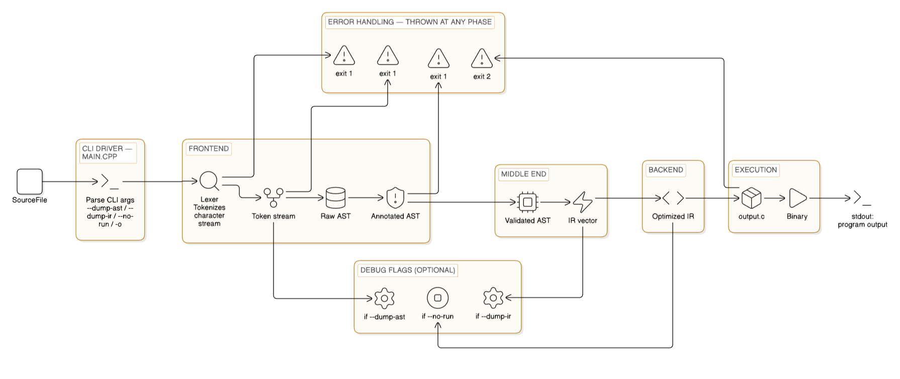

<div align="center">

# Matrix2Code

**A matrix math DSL that compiles to C**

[](https://en.cppreference.com/w/cpp/17)
[](https://cmake.org)
[](LICENSE)

[Overview](#overview) • [Features](#features) • [How it works](#how-it-works) • [Getting started](#getting-started) • [Language guide](#language-guide) • [CLI](#cli)

</div>

## Overview

Write matrix math in a clean, minimal language and get optimized C code — no MATLAB or NumPy required.

```matrix
matrix A = [[1,2],[3,4]]
matrix B = [[5,6],[7,8]]
C = A + B
D = A * B
print D
```

The compiler validates types and dimensions, then generates C code with proper loops:

```c
int main() {
    int A[2][2] = {{1,2},{3,4}};
    int B[2][2] = {{5,6},{7,8}};
    int C[2][2];
    int D[2][2];

    for(int i=0; i<2; i++)
        for(int j=0; j<2; j++)
            C[i][j] = A[i][j] + B[i][j];

    for(int i=0; i<2; i++)
        for(int j=0; j<2; j++)
            for(int k=0; k<2; k++)
                D[i][j] += A[i][k] * B[k][j];

    for(int i=0; i<2; i++)
        for(int j=0; j<2; j++)
            printf("%d ", D[i][j]);
    printf("\n");
    return 0;
}
```

## Features

- **Full compiler pipeline** — hand-written Lexer, recursive-descent Parser, AST, Semantic Analysis, IR Generation, Optimization, and C Code Generation
- **Matrix operations** — addition, subtraction, multiplication, transpose, and determinant with automatic dimension checking
- **Scalar-matrix scaling** — expressions like `2 * A` scale every element
- **Integer division** — supports `/` for scalar integer division
- **Constant folding** — compile-time evaluation of constant subexpressions (`3 + 2 * 5` becomes `13`)
- **Semantic validation** — catches type mismatches, undeclared variables, and incompatible matrix dimensions with clear error messages
- **One-step execution** — compiles the generated C with GCC and runs it automatically
- **Zero external parser tools** — hand-written C++, no Flex/Bison dependency
- **Cramer's Rule ready** — includes `det()` and `transpose()` for solving linear systems (see `examples/cramer_2x2.matrix`)

## Compiler Pipeline



## Prerequisites

| Tool | Version | Purpose |
|---|---|---|
| C++ compiler (GCC/Clang) | ≥ 9 / ≥ 12 | Build the compiler itself |
| GCC | ≥ 9 | Compile generated C code |
| CMake | ≥ 3.16 | Build system |

## Getting started

```bash
# Clone the repository
git clone https://github.com/Ahmadhassan011/Matrix2Code.git
cd Matrix2Code

# Build the compiler
cmake -B build && cmake --build build

# Write your matrix program (see examples/)
cat > example.matrix << 'EOF'
matrix A = [[1,0],[0,1]]
matrix B = [[2,3],[4,5]]
C = A * B
print C
EOF

# Compile and run
./build/compiler example.matrix
```

> [!TIP]
> Use `--dump-ast` and `--dump-ir` to inspect the compiler's internal representations as you develop your programs.
>
> Try the Cramer's Rule examples: `./build/compiler examples/cramer_2x2.matrix` or `./build/compiler examples/cramer_3x3.matrix`

## Language guide

### Data types

| Type | Description | Example |
|---|---|---|
| `scalar` | Integer value | `x = 5` |
| `matrix` | 2D integer array | `matrix A = [[1,2],[3,4]]` |

### Statements

| Statement | Syntax | Example |
|---|---|---|
| Matrix declaration | `matrix ID = literal` | `matrix A = [[1,0],[0,1]]` |
| Assignment | `ID = expression` | `x = A + B` |
| Print | `print ID` | `print result` |

### Operators

| Expression | Semantics | Dimension rule |
|---|---|---|
| `A + B` | Element-wise addition | Same dimensions |
| `A - B` | Element-wise subtraction | Same dimensions |
| `A * B` | Matrix multiplication | (M×N) * (N×P) → (M×P) |
| `s * M` | Scalar scaling (every element) | Any matrix |
| `s * t` | Scalar multiplication | N/A |
| `s + t` | Scalar addition | N/A |
| `s / t` | Integer division | N/A (scalars only) |
| `transpose(A)` | Matrix transpose (swap rows/cols) | (M×N) → (N×M) |
| `det(A)` | Matrix determinant | Square matrix only, returns scalar |

### Examples

```matrix
# Matrix multiplication
matrix A = [[1,2],[3,4]]
matrix B = [[5,6],[7,8]]
D = A * B
print D

# Scalar operations with constant folding
x = 5 + 3 * 2
y = x - 4
print y

# Scalar-matrix scaling
matrix A = [[1,2],[3,4]]
B = 2 * A
print B

# Matrix transpose
matrix A = [[1,2,3],[4,5,6]]
B = transpose(A)
print B

# Matrix determinant
matrix A = [[1,2],[3,4]]
d = det(A)
print d

# Cramer's Rule — solve 2x2 linear system
#   2x + 3y = 7
#   4x - 5y = 2
matrix A = [[2,3],[4,-5]]
matrix A1 = [[7,3],[2,-5]]
matrix A2 = [[2,7],[4,2]]
detA = det(A)
detA1 = det(A1)
detA2 = det(A2)
x = detA1 / detA
y = detA2 / detA
print x
print y
```

### Error handling

When the compiler encounters an error, it stops with a clear message:

```
Error on line 5: 'Z' undeclared
Error on line 3: cannot add scalar and matrix
Error on line 4: matrix dims (2x3) and (3x3) incompatible for addition
Error on line 2: matrix literal has inconsistent row lengths (row 0: 3 cols, row 1: 2 cols)
Error on line 3: det requires a square matrix, got 2x3
Error on line 2: cannot transpose a scalar
Error on line 1: division by zero
```

## CLI

```bash
compiler <source.matrix> [-o output.c] [--no-run] [--dump-ast] [--dump-ir]
```

| Flag | Description |
|---|---|
| `<source.matrix>` | Input source file (required) |
| `-o <output.c>` | Output C file (default: `output.c`) |
| `--no-run` | Generate C without compiling/executing |
| `--dump-ast` | Print AST before code generation |
| `--dump-ir` | Print IR before code generation |
| `--help` | Show usage |

Exit codes: `0` success, `1` compilation error, `2` runtime error.

## Resources

- [C++17 language reference](https://en.cppreference.com/w/cpp/17)
- [GCC online documentation](https://gcc.gnu.org/onlinedocs/)
